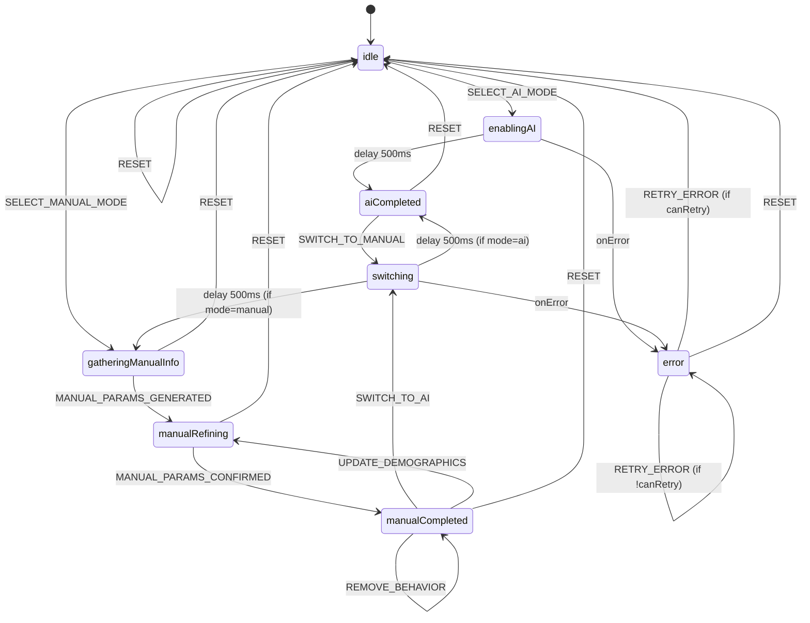

# Audience Targeting State Machine

## 📊 Visual State Diagram



## 🔄 State Descriptions

### Initial State
- **idle** - User hasn't selected targeting mode yet
  - Shows two-card selection UI (AI Advantage+ vs Manual)
  - No targeting data exists
  - Entry point for new campaigns

### AI Advantage+ Flow States

- **enablingAI** - Activating AI Advantage+
  - Shows loading spinner
  - Sets mode to 'ai' and advantage_plus_enabled to true
  - Clears any previous manual targeting data
  - Duration: 500ms (guaranteed user feedback)

- **aiCompleted** - AI Advantage+ active
  - Shows AI Advantage+ benefits UI
  - Button says "Switch to Manual Targeting"
  - Ready for campaign launch
  - Can switch to manual mode

### Manual Targeting Flow States

- **gatheringManualInfo** - AI asking questions
  - Shows "Building Your Audience Profile" screen
  - AI chat active for audience description
  - Waiting for user input

- **generatingManualParams** - AI generating parameters
  - Optional intermediate state
  - AI processing audience description
  - Can transition immediately to refining

- **manualRefining** - User reviewing/editing
  - Shows demographics, interests, behaviors
  - User can add/remove targeting criteria
  - Edit demographics
  - Confirm when ready

- **manualCompleted** - Manual targeting active
  - Shows complete manual targeting summary
  - Button says "Switch to AI Advantage+"
  - Ready for campaign launch
  - Can switch to AI mode or edit parameters

### Transition States

- **switching** - Mode transition in progress
  - Shows loading spinner: "Switching targeting mode..."
  - Clears previous mode's data
  - Duration: 500ms (guaranteed user feedback)
  - Prevents concurrent switches (mutex pattern)

### Error State

- **error** - Something went wrong
  - Shows error message
  - "Try Again" button available (if canRetry)
  - Can reset to idle state
  - Logs error details

## 📝 Event Descriptions

### Selection Events

```typescript
{ type: 'SELECT_AI_MODE' }
```
Triggered when user clicks "Enable AI Advantage+" from idle state.

```typescript
{ type: 'SELECT_MANUAL_MODE' }
```
Triggered when user clicks "Set Up Manual Targeting" from idle state.

### Switching Events

```typescript
{ type: 'SWITCH_TO_AI' }
```
Triggered when user clicks "Switch to AI Advantage+" from manual completed state.

```typescript
{ type: 'SWITCH_TO_MANUAL' }
```
Triggered when user clicks "Switch to Manual Targeting" from AI completed state.

### Manual Targeting Events

```typescript
{ 
  type: 'MANUAL_PARAMS_GENERATED',
  demographics: Demographics,
  interests: TargetingOption[],
  behaviors: TargetingOption[]
}
```
Triggered by AI tool when manual targeting parameters are ready.

```typescript
{ type: 'MANUAL_PARAMS_CONFIRMED' }
```
Triggered when user clicks "Confirm Targeting" in manual refining state.

```typescript
{ type: 'UPDATE_DEMOGRAPHICS', demographics: Partial<Demographics> }
```
Update age range, gender, or languages.

```typescript
{ type: 'ADD_INTEREST', interest: TargetingOption }
{ type: 'REMOVE_INTEREST', interestId: string }
{ type: 'ADD_BEHAVIOR', behavior: TargetingOption }
{ type: 'REMOVE_BEHAVIOR', behaviorId: string }
```
Add/remove targeting criteria.

### Control Events

```typescript
{ type: 'RESET' }
```
Return to idle state from anywhere.

```typescript
{ type: 'RETRY_ERROR' }
```
Retry after error (subject to canRetry guard).

## 🛡️ Guards (Transition Conditions)

### isNotAlreadyInMode
Prevents redundant mode switches.
```typescript
if (mode === 'ai' && event.type === 'SWITCH_TO_AI') return false;
```

### hasCompleteDemographics
Validates demographics before confirming manual targeting.
```typescript
return !!(demographics && demographics.ageMin && demographics.ageMax && demographics.gender);
```

### hasTargetingCriteria
Ensures at least one interest or behavior selected.
```typescript
return interests.length > 0 || behaviors.length > 0;
```

### areValidDemographics
Validates age range (13-65) and gender.
```typescript
return ageMin >= 13 && ageMax <= 65 && ageMin < ageMax;
```

### canRetry
Prevents infinite retry loops.
```typescript
return transitionCount < 10;
```

## ⚙️ Actions (Side Effects)

### Mode Actions
- **setAIMode** - Set mode='ai', clear manual data
- **setManualMode** - Set mode='manual', clear AI flag
- **clearManualData** - Remove demographics and interests

### Data Actions
- **setGeneratedDemographics** - Store AI-generated parameters
- **updateDemographics** - Partial demographics update
- **addInterest/removeInterest** - Manage interests array
- **addBehavior/removeBehavior** - Manage behaviors array

### Metadata Actions
- **incrementTransitionCount** - Track state changes
- **resetToInitial** - Clear all data, return to defaults

### Error Actions
- **setError** - Store error message
- **clearError** - Remove error message

### Logging Actions
- **logTransition** - Log state changes (debug mode)
- **logError** - Log errors (always)

## 🔄 State Persistence

### Save Format (v2 - XState)
```json
{
  "version": 1,
  "machineState": "aiCompleted",
  "context": {
    "mode": "ai",
    "advantage_plus_enabled": true,
    "demographics": undefined,
    "detailedTargeting": undefined,
    "errorMessage": undefined,
    "metadata": {
      "lastModified": "2025-01-12T10:30:00.000Z",
      "transitionCount": 5,
      "campaignId": "abc-123"
    }
  },
  "timestamp": "2025-01-12T10:30:00.000Z"
}
```

### Legacy Format (v1 - useState)
```json
{
  "status": "completed",
  "targeting": {
    "mode": "ai",
    "advantage_plus_enabled": true
  },
  "isSelected": true
}
```

### Migration
- Automatic on first load
- No manual intervention needed
- Preserves all user data

## 🧪 Testing the State Machine

### Unit Test Example
```typescript
import { interpret } from 'xstate';
import { audienceMachine } from '@/lib/machines/audience/machine';

test('AI flow', () => {
  const actor = interpret(audienceMachine).start();
  
  expect(actor.getSnapshot().value).toBe('idle');
  
  actor.send({ type: 'SELECT_AI_MODE' });
  expect(actor.getSnapshot().value).toBe('enablingAI');
  
  // Wait for delay
  await new Promise(r => setTimeout(r, 600));
  
  expect(actor.getSnapshot().value).toBe('aiCompleted');
  expect(actor.getSnapshot().context.mode).toBe('ai');
});
```

### Integration Test Example
```typescript
test('Switch from manual to AI', async () => {
  // 1. Set up manual targeting
  const machine = useAudienceMachineHook('campaign-123');
  machine.selectManualMode();
  machine.send({ type: 'MANUAL_PARAMS_GENERATED', demographics, interests, behaviors });
  machine.confirmManualParameters();
  
  expect(machine.state).toBe('manualCompleted');
  
  // 2. Switch to AI
  machine.switchToAI();
  expect(machine.state).toBe('switching');
  
  // 3. Wait for transition
  await waitFor(() => expect(machine.state).toBe('aiCompleted'));
  
  // 4. Verify manual data cleared
  expect(machine.context.demographics).toBeUndefined();
  expect(machine.context.detailedTargeting).toBeUndefined();
});
```

## 🎯 Design Principles

1. **Single Source of Truth** - State machine is the only authority
2. **Atomic Updates** - All state changes happen in one operation
3. **Immutability** - All updates use `assign()` for immutable changes
4. **Predictability** - Finite states mean finite possibilities
5. **Debuggability** - Visual charts + logging + DevTools
6. **Type Safety** - Full TypeScript coverage
7. **Testability** - Pure functions, isolated logic
8. **Performance** - Reduced re-renders, optimized updates

## 📚 API Reference

### Hook: `useAudienceMachineHook(campaignId)`

**Returns:**
```typescript
{
  // State
  state: AudienceMachineState,
  context: AudienceMachineContext,
  
  // State checks
  isIdle, isEnablingAI, isAICompleted, 
  isGatheringManualInfo, isManualRefining, isManualCompleted,
  isSwitching, isError,
  
  // Mode checks
  isAIMode, isManualMode,
  
  // Actions
  selectAIMode(), selectManualMode(),
  switchToAI(), switchToManual(),
  confirmManualParameters(),
  updateDemographics(demographics),
  addInterest(interest), removeInterest(id),
  addBehavior(behavior), removeBehavior(id),
  reset(), retryError(),
  
  // Capability
  can(event) => boolean,
  
  // Loading
  isLoading, isInitializing
}
```

### Context: `useAudience()` (Backward Compatible)

Same API as before, but powered by XState under the hood.

---

**Last Updated:** 2025-01-12  
**Version:** 1.0.0 (XState)  
**Status:** ✅ Production Ready (with feature flag)

